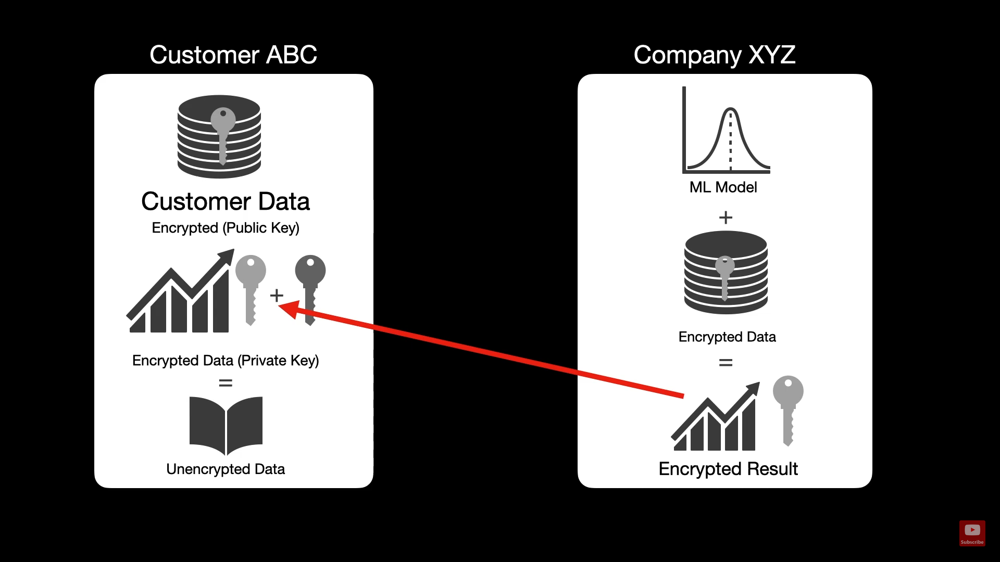

# Homomorphic Encryption
Homomorphic encryption is a form of encryption that permits users to perform computations on its encrypted data without first decrypting it. These resulting computations are left in an encrypted form which, when decrypted, result in an identical output to that produced had the operations been performed on the unencrypted data. Homomorphic encryption can be used for privacy-preserving outsourced storage and computation. This allows data to be encrypted and out-sourced to commercial cloud environments for processing, all while encrypted.

## A certain example to show usage of HE

Suppose there is a company **XYZ** which provides Machine learning services through encrypted means to user **ABC** which uses certain parameters to predict his salary through the company's portal such as `age` ,`healthy eating scale` , `active worklife scale` and `gender`. First of all we will use the 
```bash
storeKeys() and getKeys() methods
```  
to generate and load the public and private keys on the client side. After that the client's data will be encrypted using the
```bash
serializeDataCustomer() method
```  
Now company will load and compute on the data using their **Linear Regression** model using these methods
```bash
getData() and computeData()
```  
This is the power of HE , as the company now predicts the customer's salary without actually knowing the values  (as it is encrypted by the client's side ) using complex cryptographic operations .
Finally company sends the response back to user as json file which contains the encrypted result and public key using the method
```bash
serializeDataCompany()
``` 


### How to Run Locally

1. **Clone the Repository**
   
   ```bash
   git clone https://github.com/yourusername/Partial-Homomorphic-Encryption-on-Machine-learning.git
   cd Partial-Homomorphic-Encryption-on-Machine-learning
   ```

2. **Set Up a Conda Environment**
   
   ```bash
   conda create -n phe_ml_env python=3.8
   conda activate phe_ml_env
   ```

3. **Install Dependencies**
   
   ```bash
   pip install -r requirements.txt
   ```

4. **Train the Machine Learning Model**
   
   Before running the application, train the model to generate the `improved_model.pkl` file.
   
   ```bash
   python train.py
   ```

5. **Generate Encryption Keys**
   
   ```python
   # ...existing code...
   python cust.py
   ```

6. **Start the Flask Application**
   
   ```bash
   python app.py
   ```

7. **Access the Application**
   
   Open your web browser and navigate to `http://localhost:5000/` to interact with the application.

## Usage

The main `app.py` (Flask file) contains the code for implementing all the above functions
```bash
@app.route('/customerEncryption', methods=['GET','POST']) 
def customerEncryption():    # Handles the encryption on client side

@app.route('/company', methods=['GET','POST'])
def company():               # Handles the encryption on company side

@app.route('/result', methods=['GET','POST'])
def result():                # Generates the final output on the client side
```

## Final Thoughts
* This is a high-level glimpse into the future of ML and cryptography but not yet production-ready.
* Partial Homomorphic Encryption is a great way to perform complex ML computations on encrypted samples.
* Evolving space with Fully-Homomorphic Encryption which is in research right now.
* This will likely be in demand in the next 5-7 years.

## Contributing
Pull requests are welcome. For major changes, please open an issue first to discuss what you would like to change.
Thanks for reading this and if you like this content please give a **LIKE** to this repository.

## License
[MIT](https://choosealicense.com/licenses/mit/)